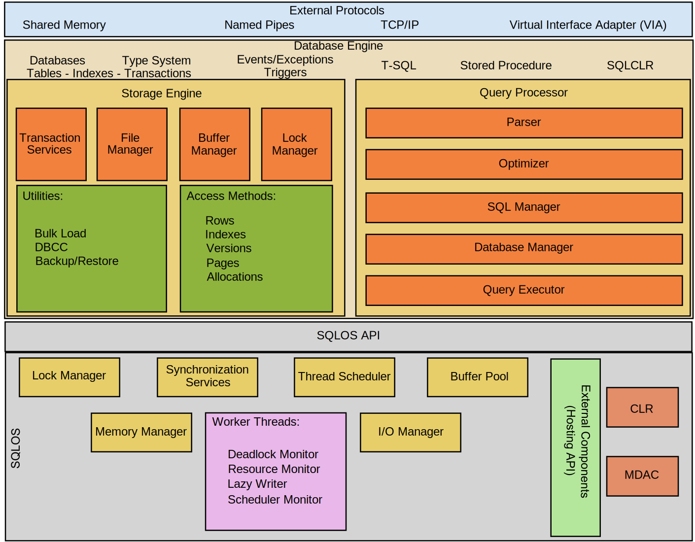

# 001.001. What is SQL Server

**SQL Server** is a **relational database management system (RDBMS)** developed and marketed by **Microsoft**.

Like other RDBMS platforms, SQL Server is built on **SQL (Structured Query Language)**, the standard language for querying and managing relational databases. SQL Server uses **Transact-SQL (T-SQL)**, Microsoft’s proprietary extension to SQL, which includes additional programming constructs.

Initially exclusive to Windows for over 20 years, **SQL Server 2017**, released in **October 2017**, was the first version to support both **Windows and Linux** environments.

---

## SQL Server Architecture

The following diagram illustrates the architecture of the SQL Server:

SQL Server architecture is composed of two main components:

- **Database Engine**
- **SQLOS (SQL Server Operating System)**

### 1. Database Engine

The **Database Engine** is the core of SQL Server. It includes:

- **Relational Engine**: Also known as the query processor, it determines the optimal method to execute queries. It handles:
      - Memory management
      - Thread and task management
      - Buffer management
      - Distributed query processing

- **Storage Engine**: Manages the storage and retrieval of data. It interacts with physical storage systems suchs as **disks** and **Storage Area Networks (SANs)**.

The Database Engine also creates and manages database objects such as:

- Stored procedures
- Views
- Triggers

### 2. SQLOS

**SQLOS** sits beneath the Relational and Storage Engines, providing essential operating system-level services, including:

- Memory management
- I/O management
- Exception handling
- Synchronization services

---

## SQL Server Services and Tools

Microsoft bundles SQL Server with a suite of **data management** and **business intelligence (BI)** tools.

## Data Management Tools

- **SQL Server Integration Services (SSIS)**
- **SQL Server Data Quality Services**
- **SQL Server Master Data Services**

## Development and Management Tools

- **SQL Server Data Tools (SSDT)** – for database development
- **SQL Server Management Studio (SSMS)** – for managing, deploying, and monitoring databases

## Analytics and Reporting Tools

- **SQL Server Analysis Services (SSAS)** – for online analytical processing (OLAP)
- **SQL Server Reporting Services (SSRS)** – for reporting and data visualization
- **Machine Learning Services** – introduced in SQL Server 2016 (originally as R Services)

---

## SQL Server Editions

SQL Server comes in several editions tailored to different needs. The **main editions** include:

### Free Editions

- **Developer Edition**: Full-featured, for development and testing only.
- **Express Edition**: Lightweight, ideal for small applications. Limited to **10 GB** of storage.

### Paid Editions

- **Enterprise Edition**: Full set of features for **mission-critical applications** and **large-scale performance**.
- **Standard Edition**: Subset of Enterprise features. Includes limitations on:
      - Number of processor cores
      - Memory capacity

### Other Editions

- **Web Edition**: Cost-effective solution for **web hosting companies**.

For more details, refer to the [**SQL Server 2022 Editions** documentation](https://learn.microsoft.com/en-us/sql/sql-server/editions-and-components-of-sql-server-2022?view=sql-server-ver16).
