# 001.002. **Install SQL Server**

## **Install SQL Server 2022 Developer Edition**

### **Download SQL Server 2022**

To download SQL Server 2022, click the link below:
**[Download SQL Server](https://www.microsoft.com/en-us/sql-server/sql-server-downloads)**

Microsoft offers several editions of SQL Server. For learning purposes, download the **Developer Edition**.

#### **Steps to Download SQL Server 2022**

1. **Launch the Downloader**

    Select **Download Media**. This option allows you to download the setup files and install SQL Server later.

    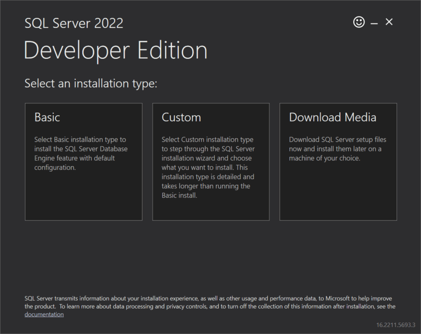

2. **Choose Download Location**

    Select a folder to store the installation files and click **Download**.

    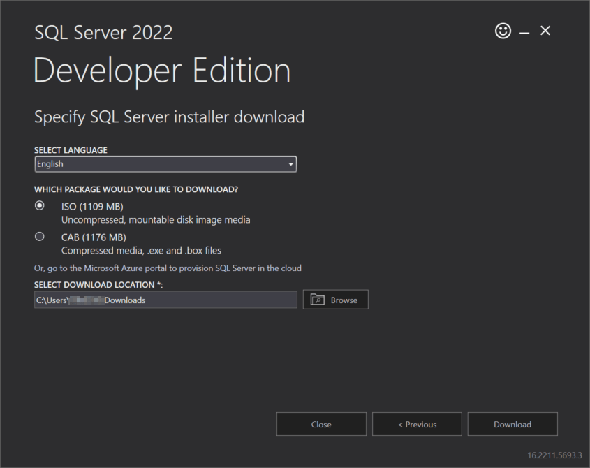

3. **Wait for Download**

    The downloader will begin downloading the installation files. This may take several minutes depending on your internet speed.

    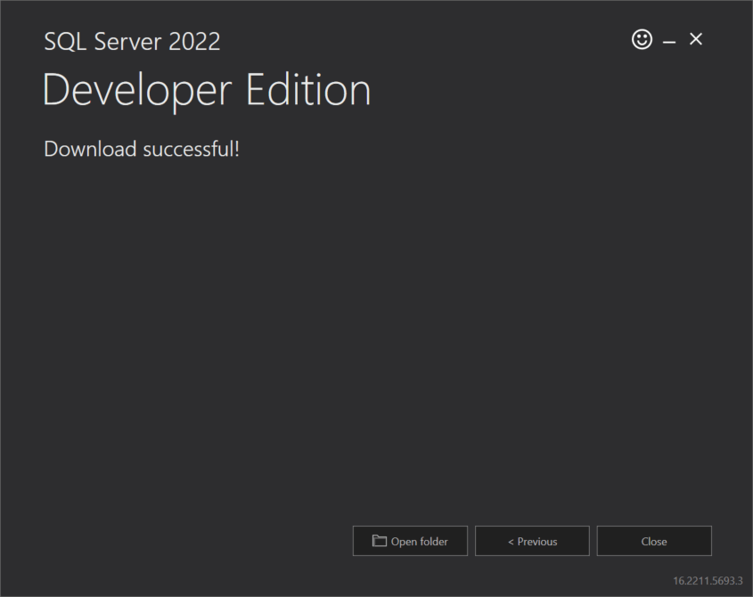

4. **Open the Download Folder**

    Once the download is complete, open the folder containing the file.

5. **Launch the Installer**

    Run the `SQLServer2022-DEV-x64-ENU` file. It will extract the contents and start the installation process.

### **Installation Steps**

1. **Start the Installer**

    In the **SQL Server Installation Center**, click **Installation** on the left pane.

    

2. **Choose Edition**

    Select **Developer Edition** and click **Next**.

    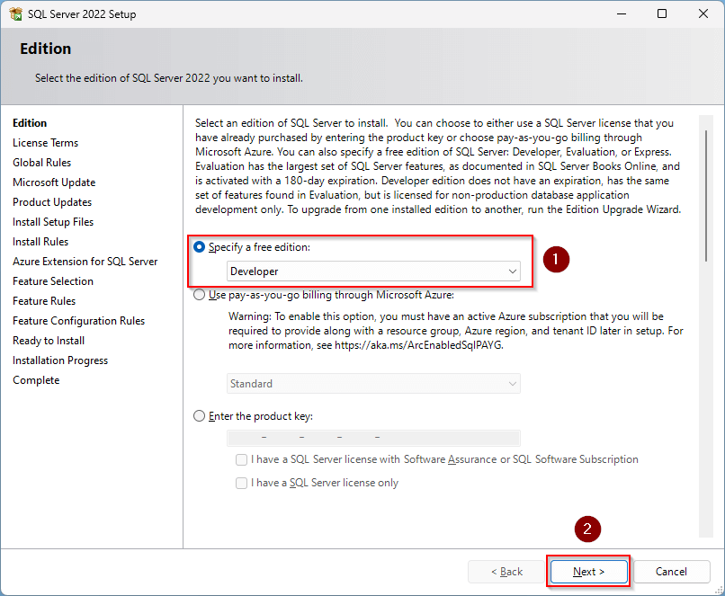

3. **Accept License Terms**

    Check **"I accept the license terms."** and click **Next**.

    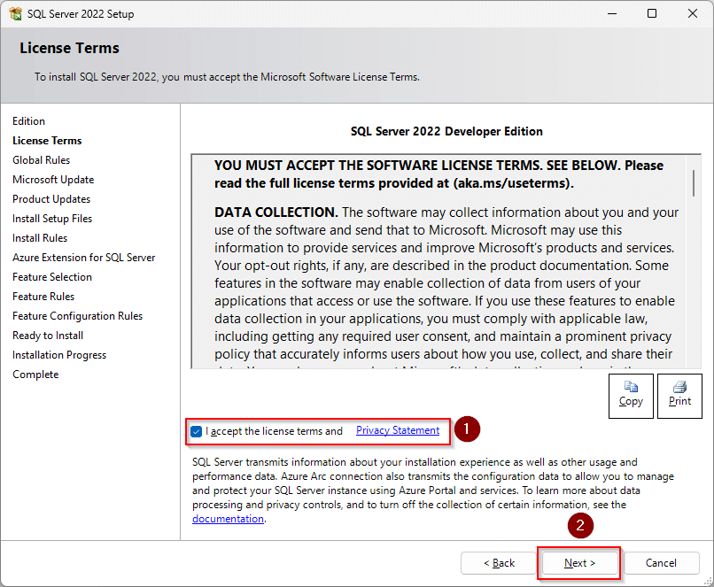

4. **Microsoft Updates**

    (Optional) Uncheck **"Use Microsoft Update to check for updates"** and click **Next**.

    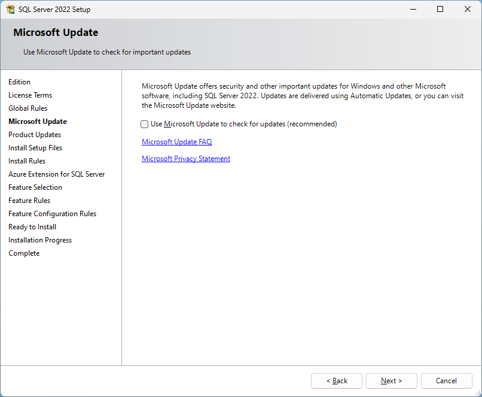

5. **Install Rules Check**

    The installer checks for prerequisites. If no errors appear, click **Next**.

    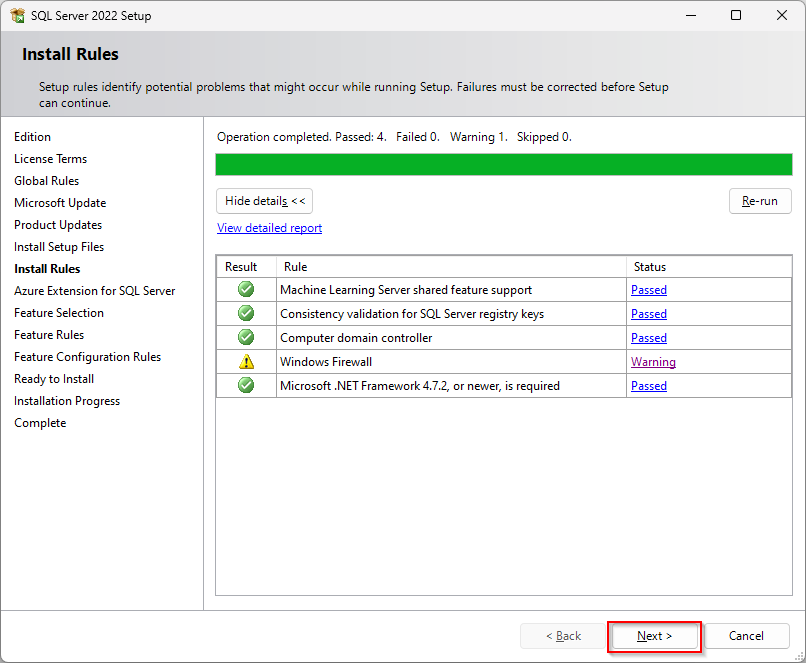

6. **Optional Extensions**

    Uncheck **Aruzé extension** for SQL Server (if applicable).

    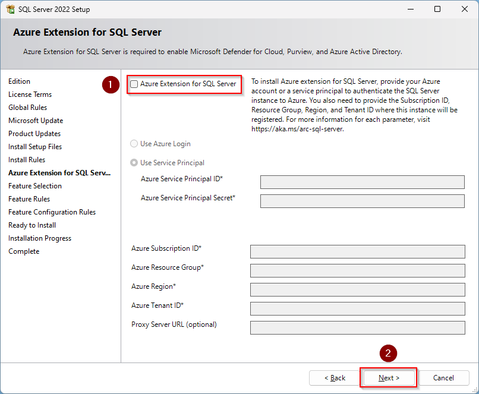

7. **Select Features**

    Choose **Database Engine Services** and click **Next**.

    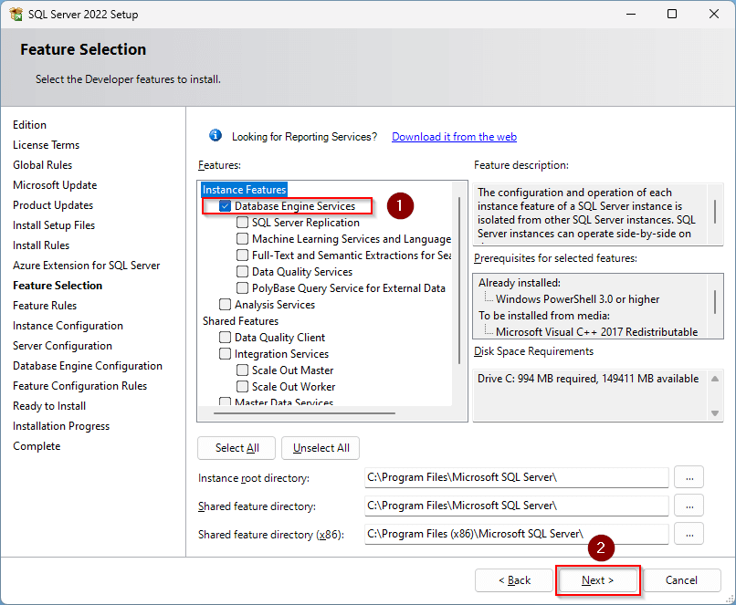

8. **Instance Configuration**

    Accept the default instance ID `MSSQLSERVER` or change if needed, then click **Next**.

    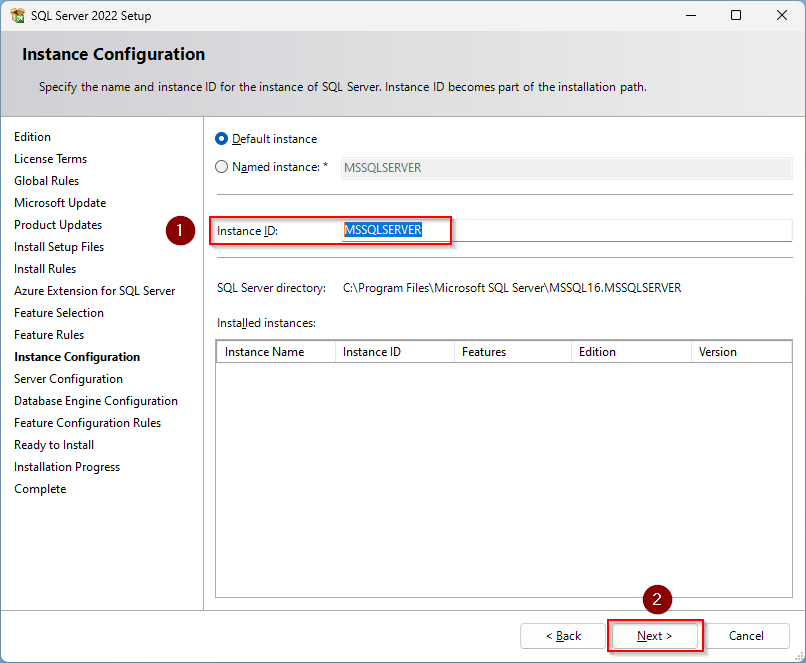

9. **Server Configuration**

    Use the default **Service Accounts** and **Collation** settings. Click **Next**.

    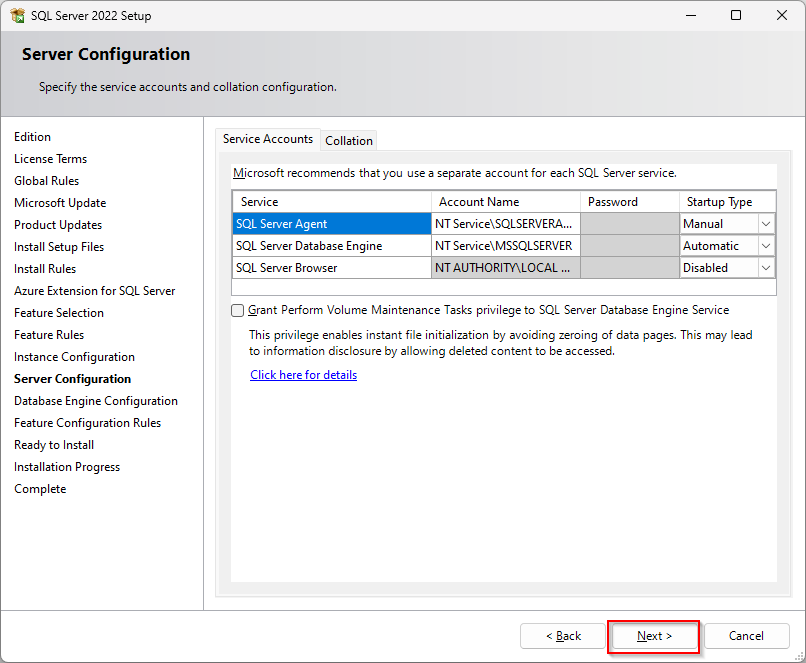

10. **Database Engine Configuration**

    * Select **Mixed Mode (SQL Server authentication and Windows authentication)**.
    * Enter and confirm the **SA (System Administrator) password**.
    * Click **Add Current User** to make yourself a SQL Server administrator.
    * Click **Next**.

    *Be sure to store the SA password in a secure place.*

    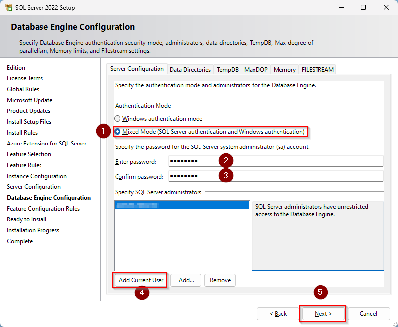

11. **Install Progress**

    The installer will show the installation progress.

    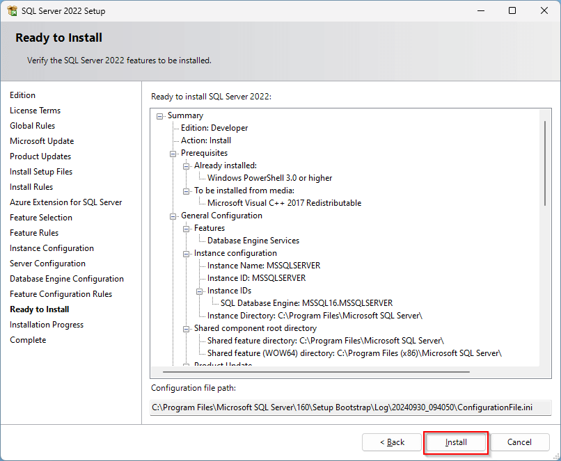

12. **Complete Installation**

    After installation, click **Close** to exit.

    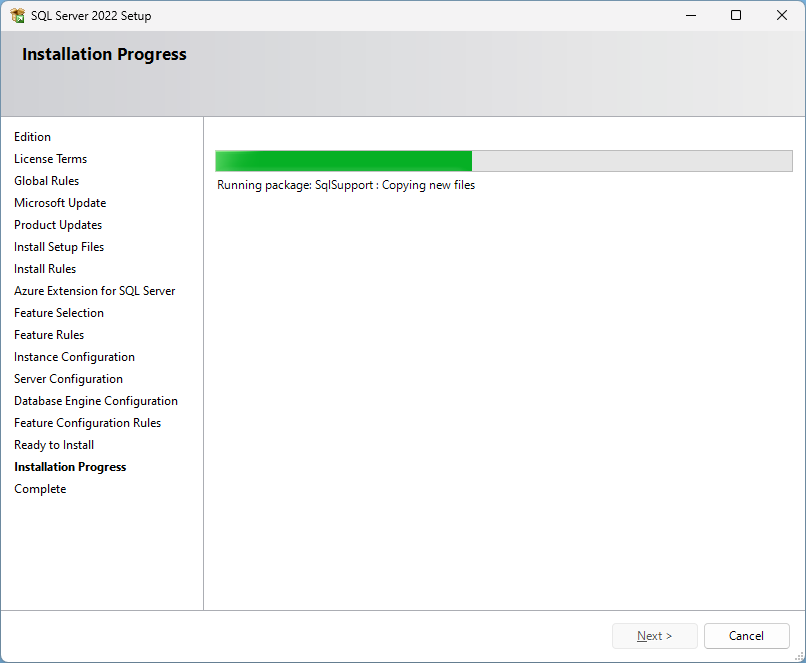

**Congratulations!** You have successfully installed **SQL Server 2022 Developer Edition**.

---

## **Install SQL Server Management Studio (SSMS)**

To interact with SQL Server, use **SQL Server Management Studio (SSMS)** — a free tool provided by Microsoft.

SSMS allows you to query, design, configure, and manage SQL Server instances both locally and remotely.

### **Download SSMS**

Download SSMS from the Microsoft website:
**[Download SQL Server Management Studio](https://learn.microsoft.com/en-us/sql/ssms/download-sql-server-management-studio-ssms)**

1. **Launch Installer**

   Run the file `SSMS-Setup-ENU.exe`.

   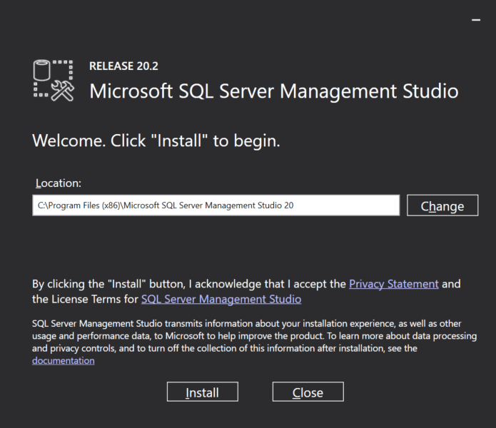

2. **Click Install**

   Start the installation by clicking the **Install** button.

   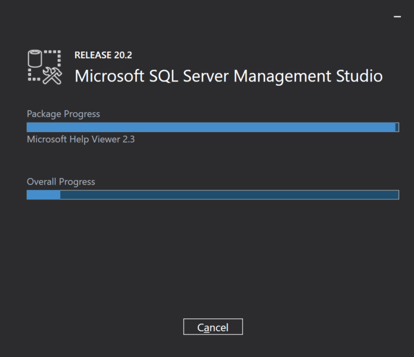

3. **Wait for Installation**

   The setup process may take a few minutes.

   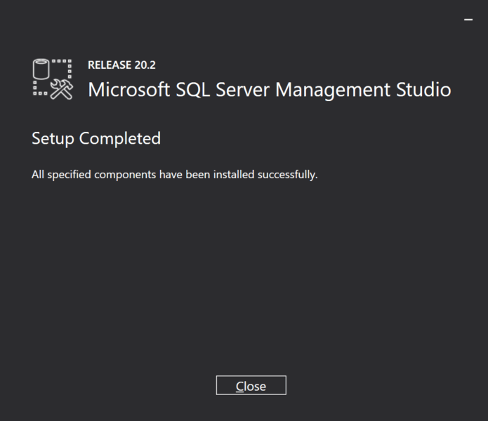

4. **Finish Installation**

   Once complete, click **Close**.
