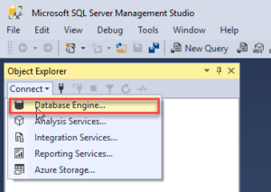
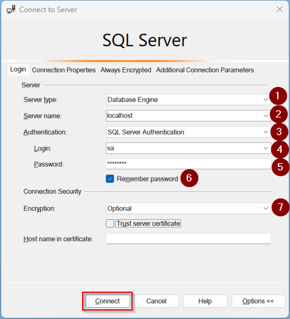
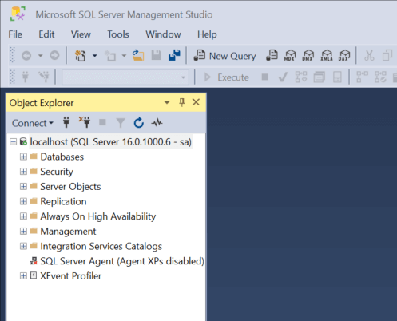
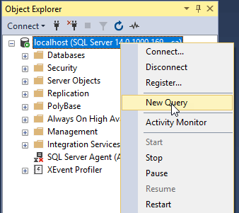
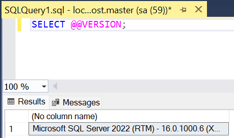

# 001.003. **Connect to the SQL Server**

## 1. Connect to SQL Server Using SSMS

To connect to SQL Server using Microsoft SQL Server Management Studio, follow these steps:

### Step 1: Launch SSMS

Open **Microsoft SQL Server Management Studio** from your Start menu or desktop shortcut.


### Step 2: Open the Connection Dialog

In **Object Explorer**, click **Connect** > **Database Engine**.



### Step 3: Enter Server Connection Details

* **Server Type:** Database Engine
* **Server Name:** `localhost`
* **Authentication:** SQL Server Authentication
* **Login:** `sa`
* **Password:** *(Enter the password you set during installation)*
* **Remember Password:** Check
* **Encryption:** Optional

Click **Connect**.



If successful, you’ll see the **Object Explorer** panel listing your SQL Server instance.



---

## 2. Execute a Query

Follow these steps to execute a query:

### Step 1: Open a New Query Window

In **Object Explorer**, right-click the connected server node (e.g., `localhost (SQL Server...)`) and select **New Query**.



### Step 2: Enter the SQL Query

```sql
SELECT @@VERSION;
```

This query returns the version of SQL Server currently running.

### Step 3: Run the Query

Click the **Execute** button or press **F5**.

The **Results** window will display the SQL Server version.



---

## Conclusion

You’ve now successfully connected to a SQL Server instance and executed a query using SQL Server Management Studio.
