# 001.005. **Load Sample Database**

## Prerequisites

1. **Download** the sample database ZIP file:
   ➤ [SQL-Server-Sample-Database](../database/SQL-Server-Sample-Database.zip)

2. **Unzip** the file to extract the following SQL script files:
      * `BikeStores Sample Database - create objects.sql` – Creates schemas and tables.
      * `BikeStores Sample Database - load data.sql` – Inserts data into the tables.
      * `BikeStores Sample Database - drop all objects.sql` – Drops tables and schemas (for refresh/reset purposes).

---

## Load the Sample Database

### Step 1: Connect to SQL Server

* Open SQL Server Management Studio (SSMS).
* Choose the **server name**, enter the **username** and **password**, then click **Connect**.

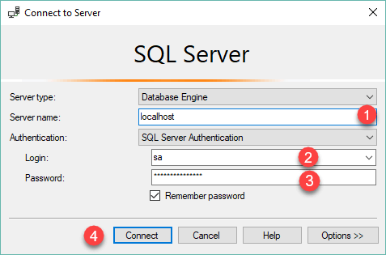

### Step 2: Create a New Database

* In **Object Explorer**, right-click the **Databases** node.
* Select **New Database…**.

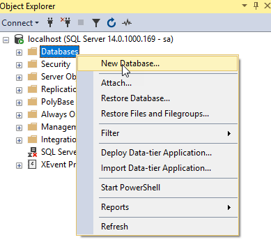

### Step 3: Name the Database

* Enter `BikeStores` as the **Database name**.
* Click **OK** to create the database.

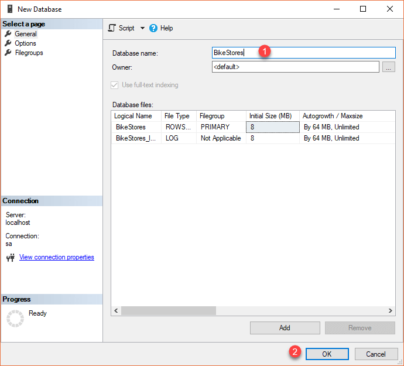

### Step 4: Verify Database Creation

* Ensure the `BikeStores` database appears under the **Databases** node.

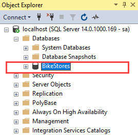

---

## Create Tables and Schemas

### Step 5: Open the Script

* From the top menu, select **File > Open > File…**.

* Choose `BikeStores Sample Database - create objects.sql`.

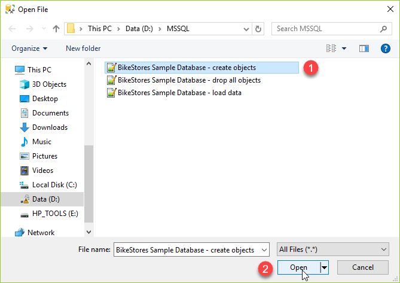

### Step 6: Execute the Script

* Click the **Execute** button to run the script.

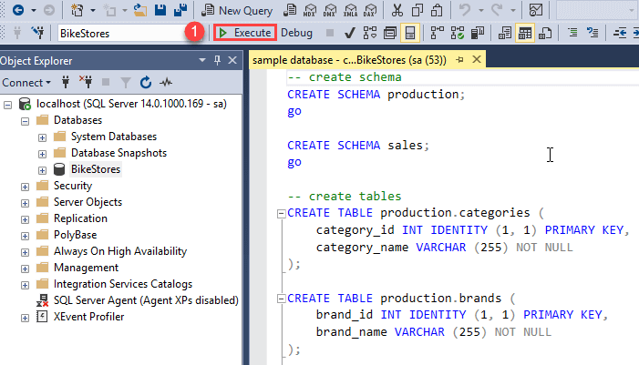

* Confirm that the script executed successfully via the messages pane.

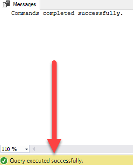

### Step 7: Verify Object Creation

* In **Object Explorer**, expand `BikeStores > Tables`.
* You should see schemas and tables created.

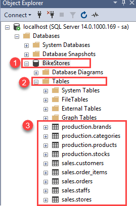

---

## Load Sample Data

### Step 8: Open the Data Script

* Go to **File > Open > File…** again.

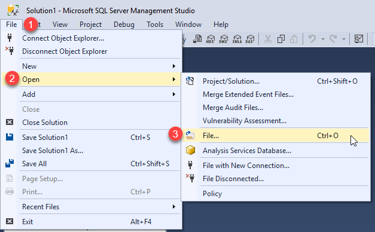

* Select `BikeStores Sample Database - load data.sql`.

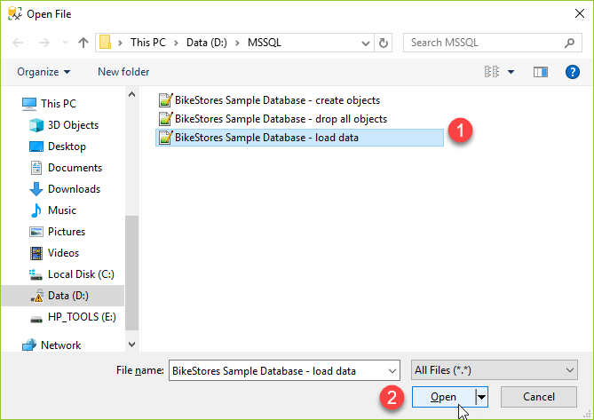

### Step 9: Execute the Script

* Click the **Execute** button.
* Confirm that the data was loaded successfully from the messages pane.

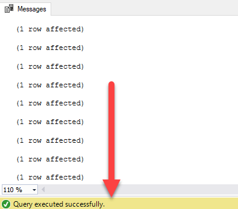

---

## Conclusion

You have successfully:

* Created the `BikeStores` database.
* Created schemas and tables using the provided SQL script.
* Loaded sample data into the tables.

You can now begin querying and exploring the `BikeStores` sample database.
